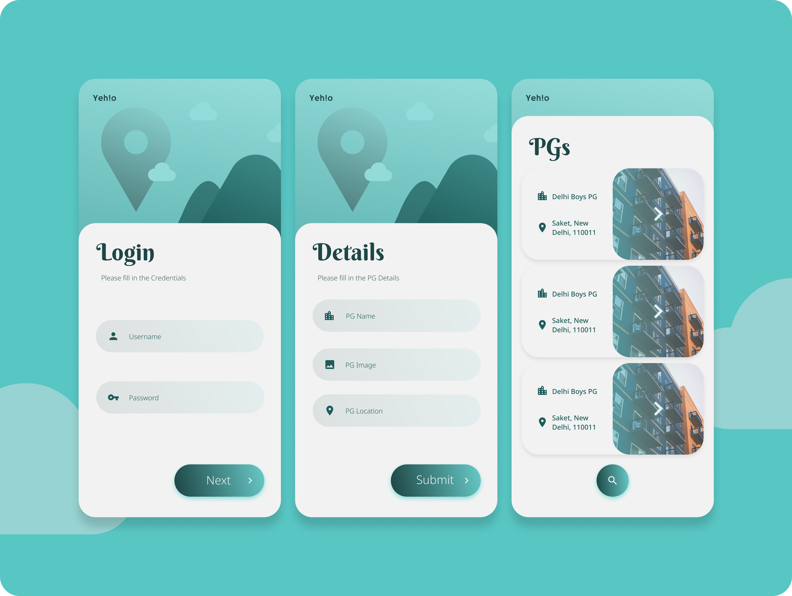
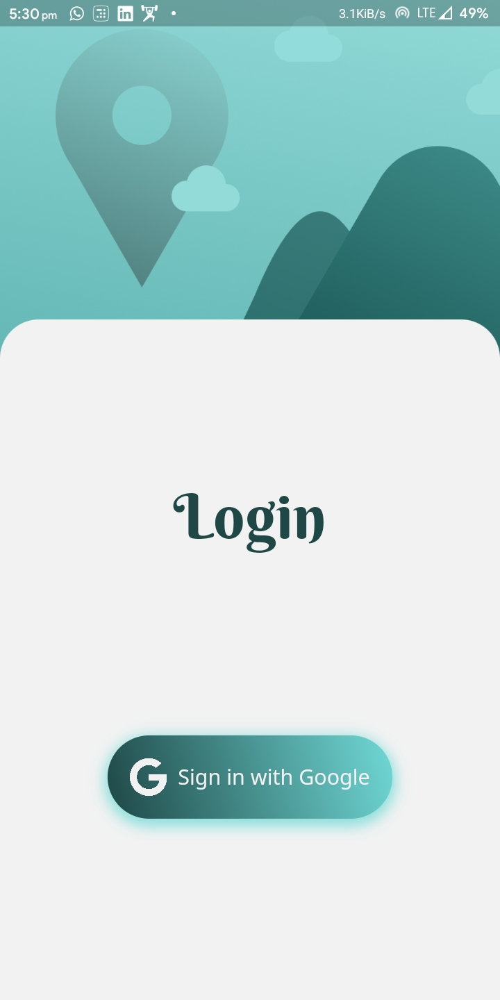
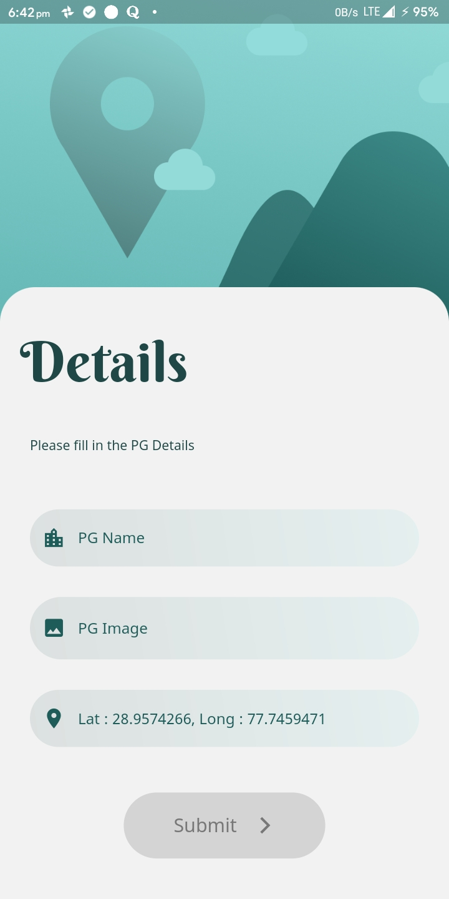
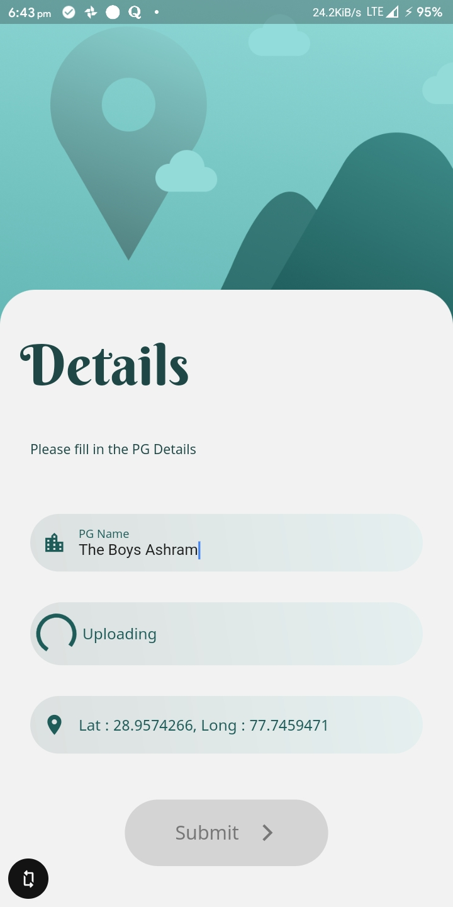
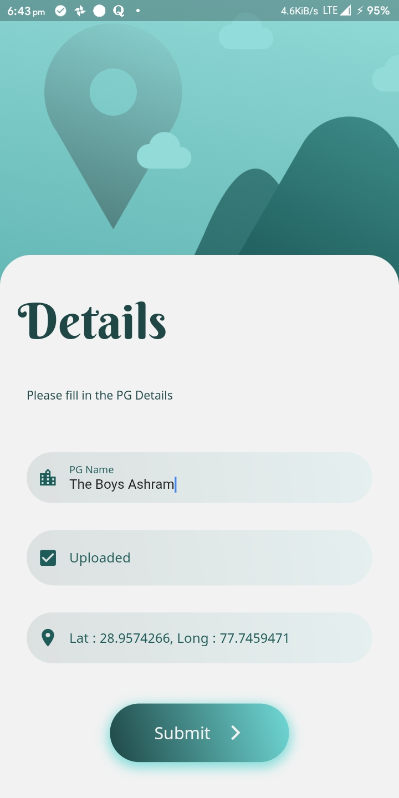
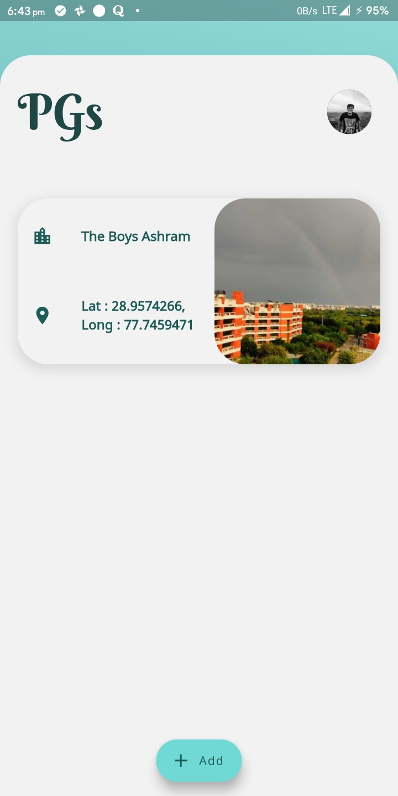

# Simple PG Rental Service App Login

This is a simple app which lets user log in using firebase and then inuput a PG for sale. This works on both Android and iOS.

The UI for this app was designed by me in Figma.

This app gets its list of PGs available from Firestore server. If a user adds a PG then it is stored on this server.

## List of Contents

1. [Features](#features)
2. [Demo](#demo)
3. [Dependencies](#dependencies)
4. [Usage](#usage)
5. [Development](#development)
6. [Contributors](#contributors)
7. [To-Do](#todemoDependencies-do)

## Features

- Minimal Design
- User Auth using Firebase Supported
- Instantly adds PG in one tap
- Automatically pickup user locationDependencies
- Stores PG Images in Firebase Storage
- Reduces Size of Images for quick loading
- Optimised storage using minimal packages
- Application size under 10 MB

## Demo

|  |  |     |
| :-------------: | :-------------: | :-------------:    |
|   Login Page    |  Details Page   |  Image Uploading   |

|  |  |  |
| :-------------: | :-------------: | :-------------: |
| Image Uploaded  |  PG Carousel    |      PG View    |

|  |
| :----------------: |
|     Demo Gif       |

## Dependencies

The following packages are needed for the development of this application.

- `firebase_auth: ^0.16.0` for User authentication
- `google_sign_in: ^4.4.4` for Google Sign-in
- `flutter_screenutil: ^1.1.0` for responsive UI
- `image_picker: ^0.6.6+1` for picking image from gallery
- `location: ^3.0.2` for picking user location
- `cloud_firestore: ^0.13.5` for storing PG data
- `firebase_storage: ^3.1.5` for storing Images
- `photo_view: ^0.9.2` for Image viewing

More details about these can be found in the [`pubspec.yaml`](https://github.com/LiquidatorCoder/simple-flutter-login/tree/master/pubspec.yaml) file.

## Usage

The application files for Android devices can be found under the [`bin`](https://github.com/LiquidatorCoder/simple-flutter-login/tree/master/bin) folder.
- [`app-arm64-v8a-release`](/bin/app-arm64-v8a-release.apk) For most users, this will work. It is for ARM x64 based devices.
- [`app-armeabi-v7a-release`](/bin/app-armeabi-v7a-release.apk) It is for ARM-based devices.
- [`app-x86_64-release`](/bin/app-x86_64-release.apk) It is for x86 based devices.

## Development

Start by forking the repository, and then run `flutter pub get` in the local repository. You are now ready to modify, fix, update, or remove any feature in the app. If you want, you can create pull requests, I will be happy to welcome them.
>Note: This project requires Flutter Framework to be installed on your machine. You will also need Firebase and Firestore API Keys.

## Contributors

## To Do

- [ ] Add app icon
- [ ] Add splash screen
- [x] Refactor the app
- [ ] Subtle Aniamtions
- [x] PG page
- [x] Hero Animations
- [ ] Pull to Refresh
- [ ] About dev page